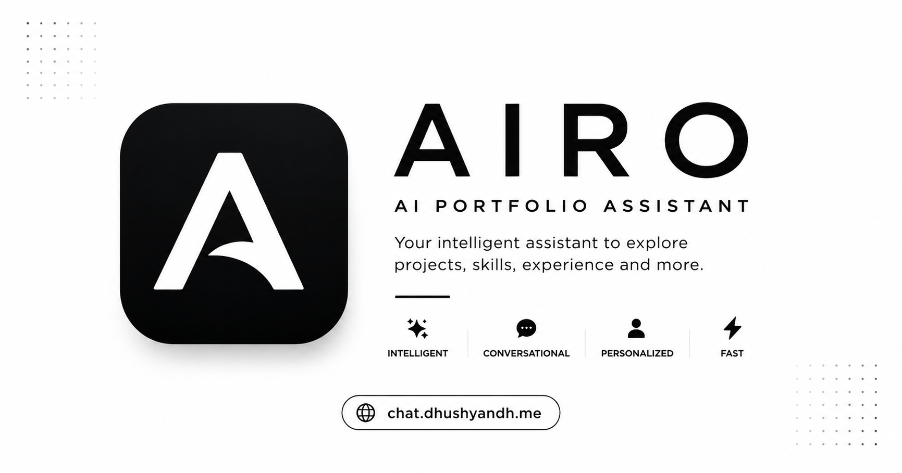

# AIRO 🤖

> An AI-powered portfolio assistant that introduces visitors to my skills, projects, and experience through natural conversations.



## ✨ Overview

AIRO is an intelligent portfolio assistant built to provide recruiters, developers, and visitors with an interactive way to explore my professional profile.

Instead of browsing a traditional portfolio, users can simply ask questions about my:

- 👨‍💻 Skills
- 🚀 Projects
- 💼 Experience
- 🎓 Education
- 📄 Resume
- 📬 Contact Information

AIRO responds using Google Gemini while maintaining persistent conversations for authenticated users.

---

## 🚀 Features

- 🔐 Clerk Authentication
- 💬 AI-powered chatbot
- 🧠 Google Gemini Integration
- 💾 Persistent chat history
- 📂 Conversation management
- 📝 Markdown responses
- 📱 Fully responsive UI
- 🌙 Modern minimalist interface
- ⚡ Streaming AI responses
- 🗑️ Chat history management
- 📄 Resume assistant
- 🎯 Suggested prompts

---

## 🛠 Tech Stack

### Frontend

- React
- Vite
- Tailwind CSS
- React Router
- Axios
- React Markdown
- Framer Motion
- Lucide Icons

### Backend

- Node.js
- Express.js

### Database

- PostgreSQL (Neon)
- Prisma ORM

### Authentication

- Clerk

### AI

- Google Gemini API

### Deployment

- Vercel (Frontend)
- Railway (Backend)

---

## 📂 Project Structure

```text
.
├── prisma/
├── public/
├── src/
│   ├── components/
│   ├── constants/
│   ├── context/
│   ├── pages/
│   └── main.jsx
├── server.js
├── package.json
└── vite.config.ts
```

---

## ⚙️ Environment Variables

Create a `.env` file.

```env
DATABASE_URL=

CLERK_SECRET_KEY=
VITE_CLERK_PUBLISHABLE_KEY=

GEMINI_API_KEY=

NODE_ENV=development
```

---

## 📦 Installation

Clone the repository

```bash
git clone https://github.com/yourusername/airo.git
```

Go into the project

```bash
cd airo
```

Install dependencies

```bash
npm install
```

Generate Prisma Client

```bash
npx prisma generate
```

Sync database

```bash
npx prisma db push
```

Run development server

```bash
npm run dev
```

---

## 📸 Screenshots

> Add screenshots here after deployment.

---

## 🌐 Deployment

Frontend

- Vercel

Backend

- Railway

Database

- Neon PostgreSQL

---

## 🔮 Future Improvements

- Voice conversations
- AI memory
- Resume upload
- Portfolio analytics
- Multi-language support
- Dark mode improvements
- Tool calling
- Document search (RAG)
- Live typing indicators

---

## 👨‍💻 Author

**Dhushyandh N**

Portfolio

https://dhushyandh.me

LinkedIn

https://linkedin.com/in/dhushyandh

GitHub

https://github.com/dhushyandh

---

## ⭐ Support

If you found this project useful, consider giving it a ⭐ on GitHub.
